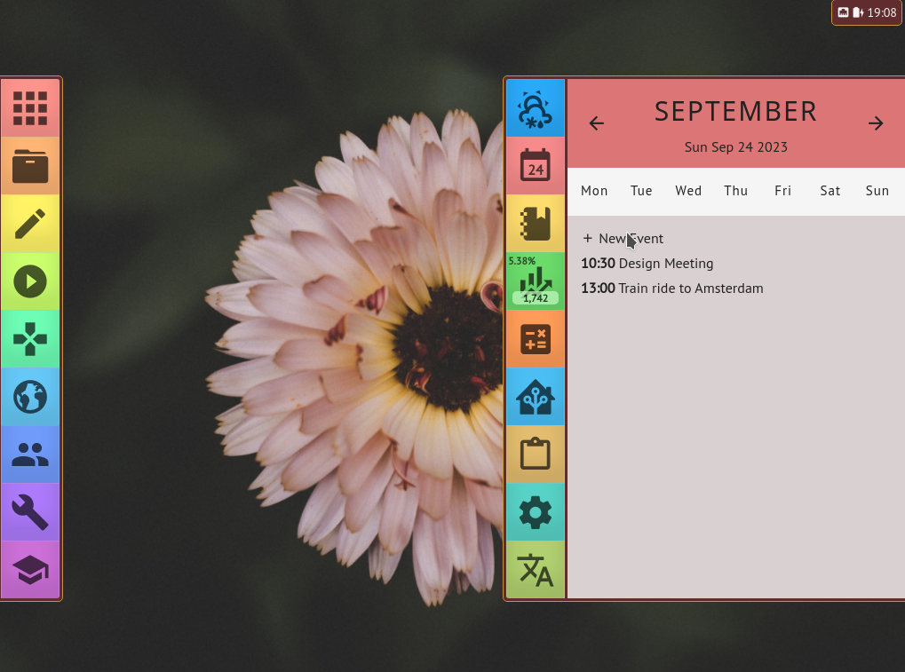

# kera

An alpha image of [Kera Desktop](https://desktop.kerahq.com/)

To try this image, you can use an existing Fedora Silverblue install.

## Rebase from Fedora Silverblue

    rpm-ostree rebase ostree-image-signed:docker://ghcr.io/ublue-os/kera-main:latest

or if you have an NVIDIA GPU:

    rpm-ostree rebase ostree-image-signed:docker://ghcr.io/ublue-os/kera-nvidia:latest
